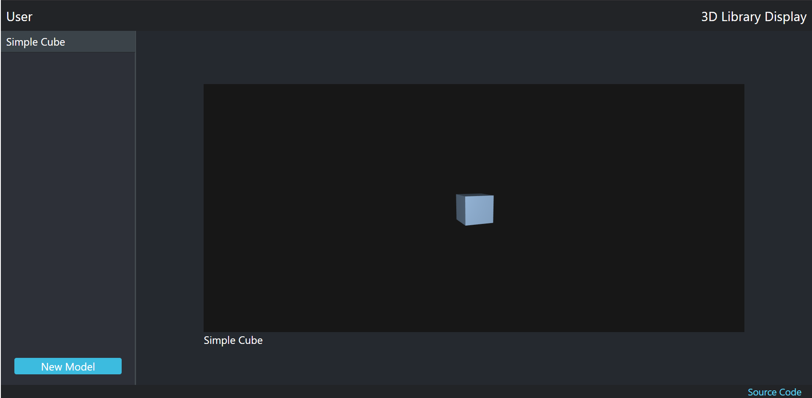

# 3d-model-browser-display

Display 3D Models in the browser

### Built With

* [.NET Core 3.1](https://dotnet.microsoft.com/download/dotnet-core/3.1) - Backend
* [React](https://reactjs.org) - JavaScript Library for building the Front-end
* [Three.js](https://threejs.org) - JavaScript 3D library for render 3D models

### Author

* **Igor Couto** - [igor.fcouto@gmail.com](mailto:igor.fcouto@gmail.com)
